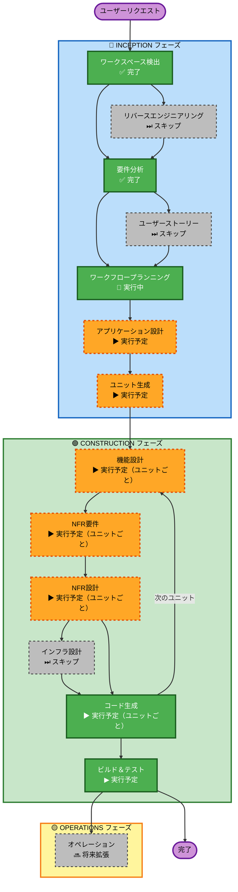

# 実行計画

## 詳細分析サマリー

### 変更インパクト評価
- **ユーザー向け変更**: あり — GUIアプリ全体が新規作成
- **構造的変更**: あり — 新規アプリケーション構造を設計
- **データモデル変更**: あり — フィード・エピソード・設定の新規モデル
- **API変更**: なし — 外部APIなし（RSSフィード取得のみ）
- **NFRインパクト**: あり — バックグラウンドスレッド、進捗表示、クロスプラットフォーム

### リスク評価
- **リスクレベル**: 低〜中
- **ロールバック複雑度**: 容易（新規プロジェクトのため）
- **テスト複雑度**: 中程度（GUI＋非同期ダウンロード）

---

## ワークフロー可視化

---

## 実行ステージ一覧

### 🔵 INCEPTION フェーズ
- [x] ワークスペース検出 — **完了**
- [x] リバースエンジニアリング — **スキップ**（新規プロジェクト）
- [x] 要件分析 — **完了**
- [x] ユーザーストーリー — **スキップ**（ユーザーは1種類のみ、要件が明確）
- [x] ワークフロープランニング — **実行中**
- [ ] アプリケーション設計 — **実行予定**
  - **理由**: 新規アプリで複数コンポーネント（フィードマネージャー、RSSパーサー、ダウンロードエンジン、GUIレイヤー）の設計が必要
- [ ] ユニット生成 — **実行予定**
  - **理由**: コアエンジンとGUIアプリを独立したユニットに分割することでテスト・開発効率が向上

### 🟢 CONSTRUCTION フェーズ（ユニットごとに繰り返し）
- [ ] 機能設計 — **実行予定**（ユニットごと）
  - **理由**: 新規データモデル（Feed、Episode）とビジネスロジック（duration解析、ダウンロード状態管理）の詳細設計が必要
- [ ] NFR要件 — **実行予定**（ユニットごと）
  - **理由**: バックグラウンドスレッド、進捗表示、クロスプラットフォーム対応などNFRの整理が必要
- [ ] NFR設計 — **実行予定**（ユニットごと）
  - **理由**: NFR要件を実行するため
- [ ] インフラ設計 — **スキップ**
  - **理由**: クラウドインフラなし。デスクトップアプリのみ（ファイルシステムアクセスはコード生成で対応）
- [ ] コード生成 — **実行予定**（ユニットごと、常時）
- [ ] ビルド＆テスト — **実行予定**（常時）

### 🟡 OPERATIONS フェーズ
- [ ] オペレーション — **プレースホルダー**（将来拡張）

---

## 想定ユニット構成

| ユニット | 内容 | 依存関係 |
|---|---|---|
| **Unit 1: コアエンジン** | データモデル（Feed・Episode）、RSSパーサー、durationパーサー、ダウンロードエンジン、設定マネージャー | なし |
| **Unit 2: GUIアプリケーション** | メインウィンドウ、フィード管理画面、エピソード一覧、ダウンロード進捗UI、設定画面 | Unit 1 |

---

## 成功基準
- **主目標**: RSSフィードからポッドキャストを選択・一括ダウンロードできるクロスプラットフォームGUIアプリの完成
- **主要成果物**: 動作するPySide6アプリ、ユニットテスト、ビルド手順書
- **品質ゲート**: 全ユニットテスト通過、Windows/macOS/Linuxで動作確認
